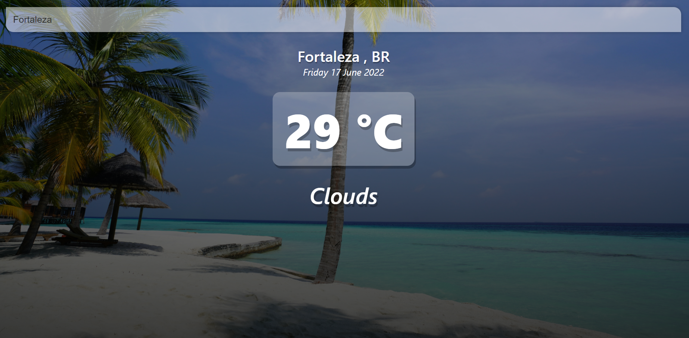
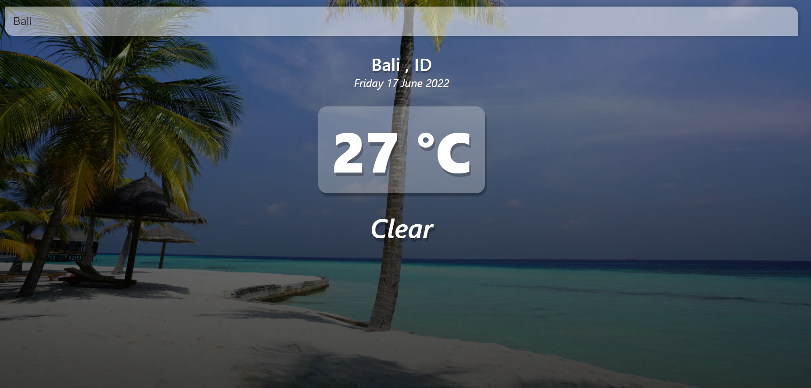
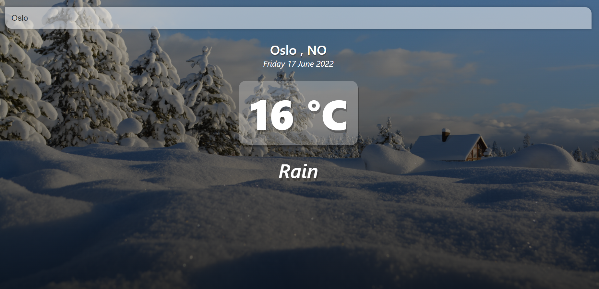
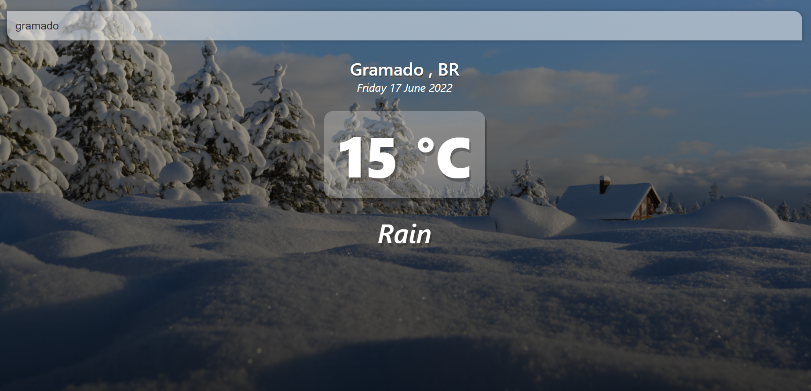

# vue-weather

Baseado no video: https://www.youtube.com/watch?v=JLc-hWsPTUY&list=PLA1RSE1qWuKClzNo6jVN6BMyVOWNR-ymd&index=9

Projeto em Vue JS , usando Open Weather Map API para fazer requests a um restful API retornando dados de clima atual. 

Usa Fetch AI do Javascriptcom me´todos de Vue JS e condicionais.

Photos by Sebastien Jermer , Datingscout , Bob Canning on Unsplash.

Ideias de implementação: a imagem mudar a cada caracteristica de tempo (chuva, sol , nuvens)

Temperaturas acima de 18°:

Temperaturas abaixo de 18°:

